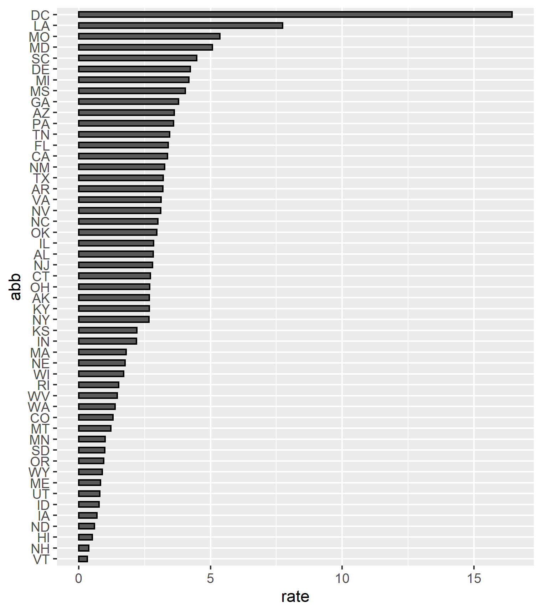

Report
================
KN
24/09/2019

Note the args include, eval, echo, message, warning

``` r
library(tidyverse)
library(knitr)
```

### ***Experimenting with eval:***

``` r
a <- 2
print(a)
```

``` r
a <- 2
print(a)
```

    ## [1] 2

### ***Experimenting with include:***

  - toggles providing code and output defined in code

a is 5 for False

``` r
a <- 5
print('hello')
```

    ## [1] "hello"

a is 5 for True

### ***Experimenting with echo:***

\*always provides output defined in code, toggles wether to show code

``` r
a <- 5
print('Hello')
```

    ## [1] "Hello"

is True

    ## [1] "Hello"

is False

### Gun Murders:

    ##         state         abb               region     population      
    ##  Alabama   : 1   AK     : 1   North Central:12   Min.   :  563626  
    ##  Alaska    : 1   AL     : 1   Northeast    : 9   1st Qu.: 1696962  
    ##  Arizona   : 1   AR     : 1   South        :17   Median : 4339367  
    ##  Arkansas  : 1   AZ     : 1   West         :13   Mean   : 6075769  
    ##  California: 1   CA     : 1                      3rd Qu.: 6636084  
    ##  Colorado  : 1   CO     : 1                      Max.   :37253956  
    ##  (Other)   :45   (Other):45                                        
    ##      total             rate        
    ##  Min.   :   2.0   Min.   : 0.3196  
    ##  1st Qu.:  24.5   1st Qu.: 1.2526  
    ##  Median :  97.0   Median : 2.6871  
    ##  Mean   : 184.4   Mean   : 2.7791  
    ##  3rd Qu.: 268.0   3rd Qu.: 3.3861  
    ##  Max.   :1257.0   Max.   :16.4528  
    ## 

#### Plot1: R generated image will scale automatically depending on display

<!-- -->

#### Plot2: User provided image for display

<!-- -->
